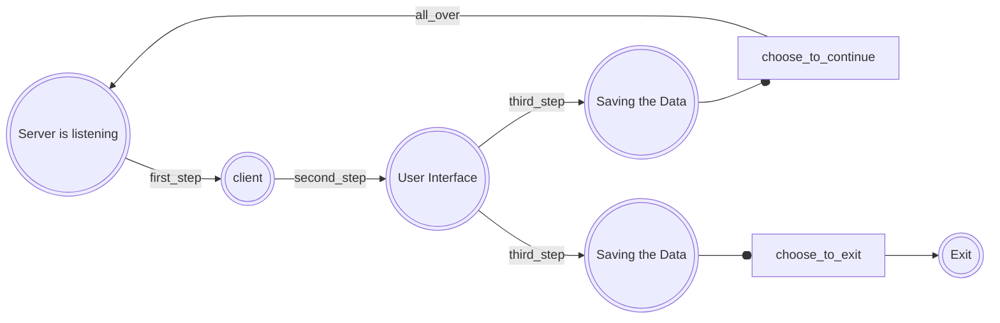

The following diagram illustrates the stages and processes:




# Python-proj

# Family Task List Project

## Table of Contents
- [Overview](#overview)
- [Prerequisites](#prerequisites)
- [Installation](#installation)
- [Usage](#usage)
- [Pipeline Stages](#pipeline-stages)
- [Configuration](#configuration)
- [Contributing](#contributing)
- [License](#license)

## Overview
This project manages a weekly repeating task list for a family. The server manages the tasks, which repeat weekly based on the days of the week, while the client allows family members to log in and mark tasks they have completed for the day. Each task has a weight (e.g., clearing dishes is worth 2 points, taking out the dog is worth 1 point, hanging laundry is worth 3 points). At the end of the week, the system announces the winner with the highest points.

## Prerequisites
- Python 3.x
- SQLite3

## Overview
This project manages a weekly repeating task list for a family. The server manages the tasks, which repeat weekly based on the days of the week, while the client allows family members to log in and mark tasks they have completed for the day. Each task has a weight (e.g., clearing dishes is worth 2 points, taking out the dog is worth 1 point, hanging laundry is worth 3 points). At the end of the week, the system announces the winner with the highest points.

## Features
- **Server**: Allows managing and editing tasks that repeat every week based on the days of the week.
- **Client**: Allows family members to log in, mark completed tasks, and see their points for the day.
- **Task Weighting**: Each task has a weight that contributes to the family member's total score.
- **Weekly Winner**: At the end of the week, the system announces the family member with the highest points as the winner.

## Server
- Edit and add family members (participants).
- Manage tasks, their weights, and the day they should be performed.

## Client
- Family members log in with their names.
- Select tasks they have completed from the list provided by the server.
- Receive points based on the tasks completed.


## Installation
### Clone the repository
```sh
git clone https://github.com/your-username/family-task-list.git
cd family-task-list
```

### Install dependencies
```sh
pip install -r requirements.txt
```

### Run the server
sh
```
python server.py
```

### Run the client
sh
```
python client.py
```


## Usage

### Server Setup
- Start the server using the command above.
- The server will listen for connections on the specified port.
- The server can handle tasks and user management.

### Client Interaction
- Run the client using the command above.
- The client will connect to the server.
- Family members can log in, select tasks they have completed for the day, and view their scores.

### File Structure
```plaintext
family-task-list/
│
├── server.py         # Server-side code
├── client.py         # Client-side code
├── user_choices.json # JSON file to store user choices
├── user_choices.db   # SQLite database for user choices
└── requirements.txt  # Python dependencies
```


## Example

### Server
- Manages the list of tasks and participants.
- Assigns weights to tasks and assigns tasks to specific days.

### Client
- Prompts the user to log in.
- Allows the user to mark tasks as completed.
- Shows the user their current score based on the completed tasks.
- Announces the weekly winner at the end of the week.

## Contributing
Contributions are welcome! Please fork this repository and submit pull requests for any features, improvements, or bug fixes.

## License
This project is licensed under the MIT License - see the LICENSE file for details.
